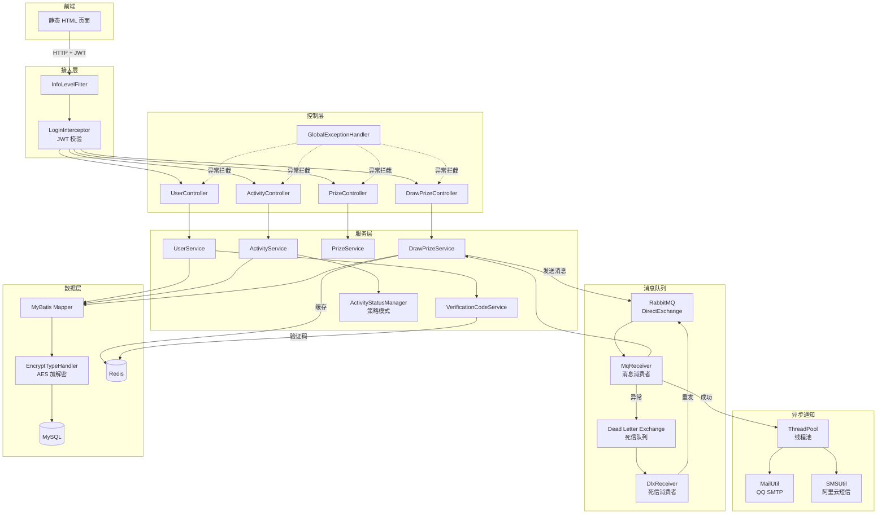
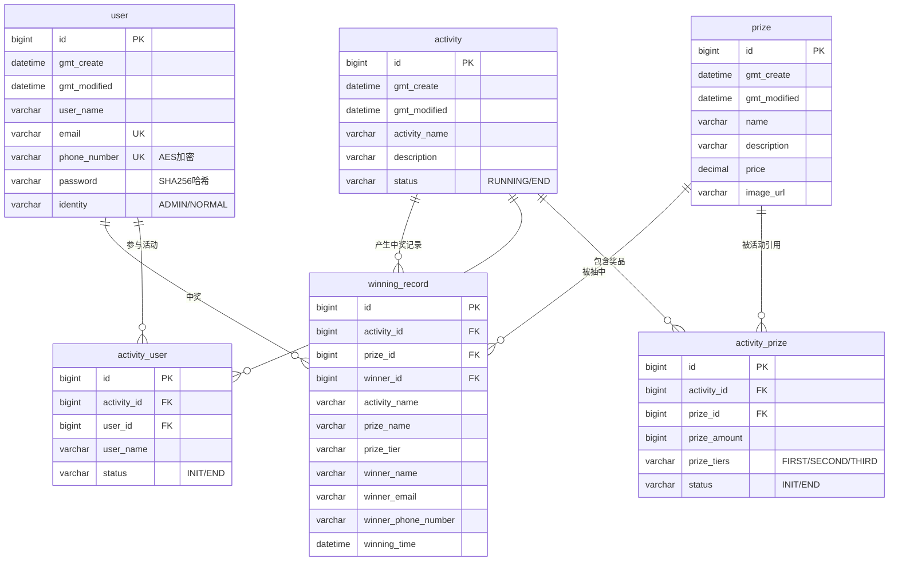
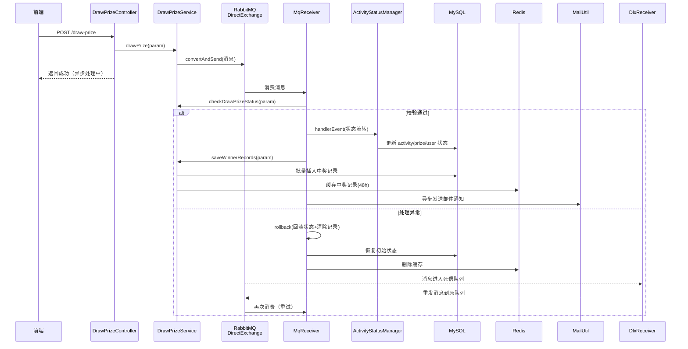
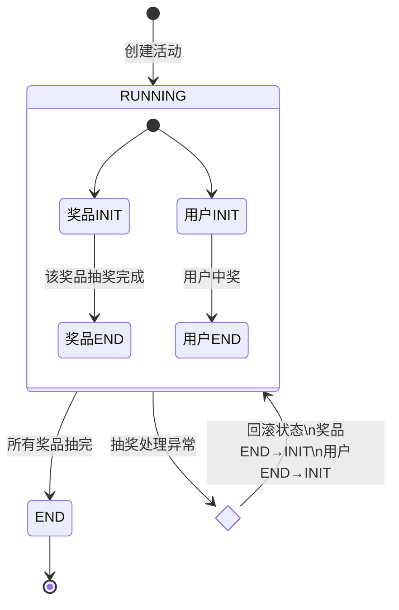
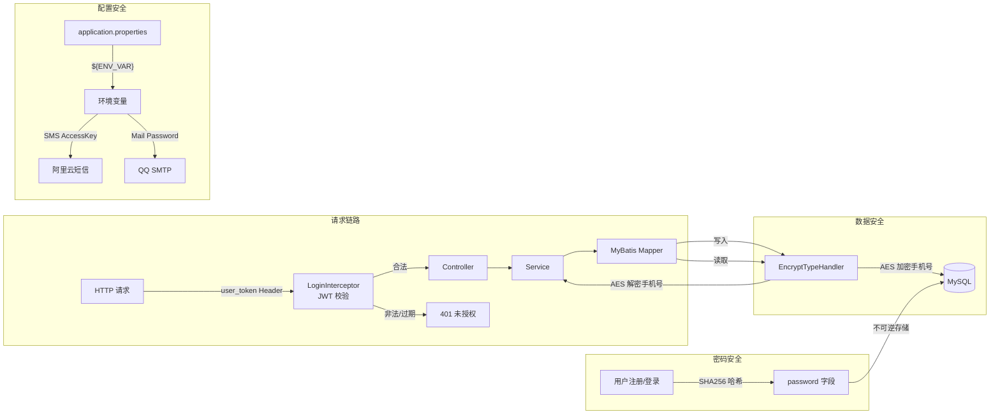
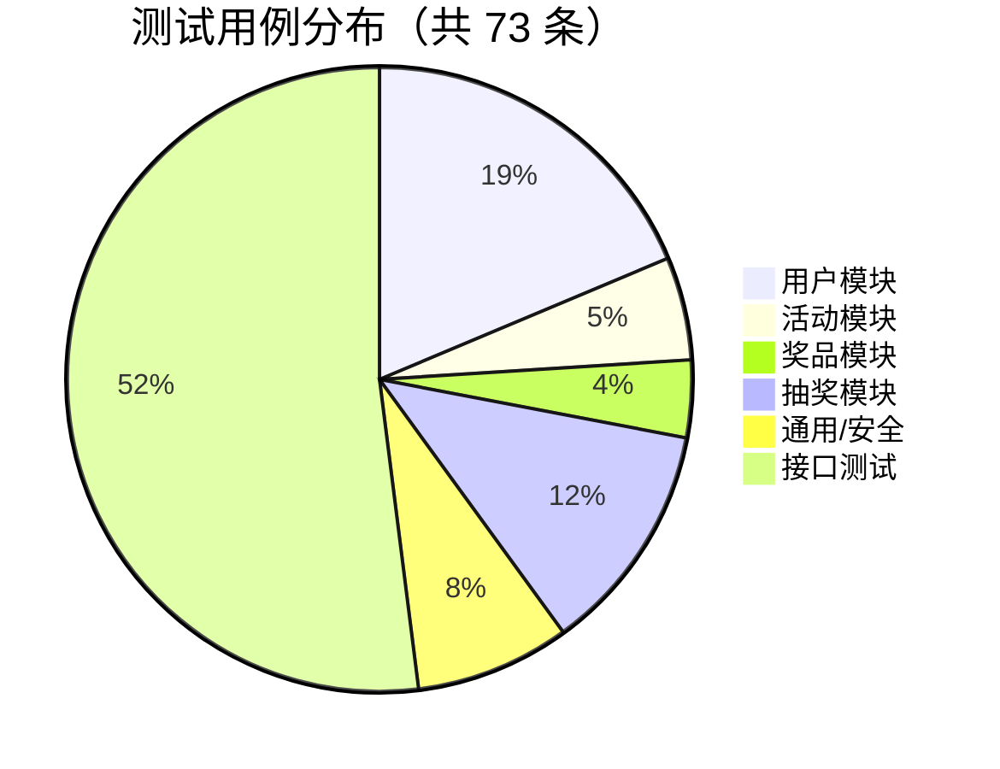
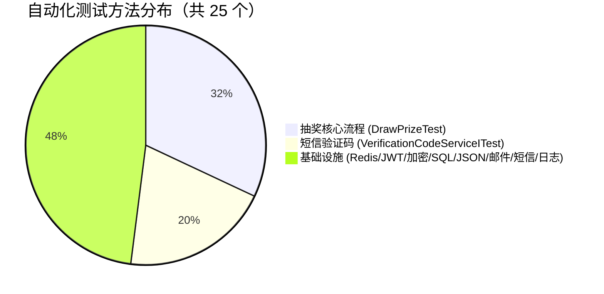
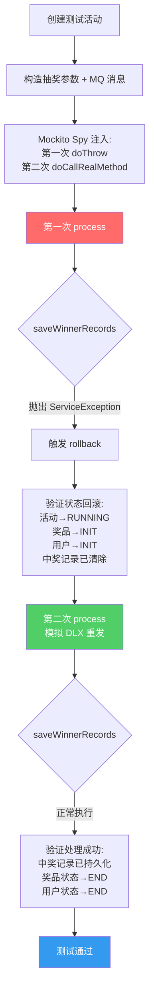

# 抽奖系统测试报告

## 1. 项目背景

这是一个基于 Spring Boot 4 + MyBatis 的抽奖系统项目。

本项目是一款集用户管理、活动管理、奖品管理、异步抽奖、中奖通知于一体的抽奖类应用，由本人独立完成设计、开发、测试的全流程工作。

### 1.1 项目简介

**模块设计**

- **用户模块**：实现用户注册（手机短信验证码）、密码登录、短信登录及管理员创建用户功能，保障用户身份管理与信息安全。
- **活动模块**：支持抽奖活动的创建、列表展示及详情查询，管理活动生命周期（进行中→已结束）。
- **奖品模块**：支持奖品创建、图片上传、列表展示，管理奖品信息与库存。
- **抽奖模块**：基于 RabbitMQ 消息队列实现异步抽奖，支持中奖记录持久化、Redis 缓存加速查询、邮件异步通知中奖者。采用死信队列（DLX）实现消息重试机制，保障抽奖流程的可靠性。

**技术栈**

- **后端**：基于 Spring Boot 4.0.2 + Spring MVC 构建服务端逻辑，以 MyBatis 4.0.0 作为持久层框架，MySQL 作为数据存储引擎，保障系统稳定性与数据可靠性。
- **消息队列**：RabbitMQ（Direct Exchange + Dead Letter Exchange），实现抽奖请求的异步解耦与失败重试。
- **缓存**：Redis（Lettuce 连接池），用于中奖记录缓存与验证码存储，提升系统响应速度。
- **安全**：JWT 令牌认证、AES 加密手机号、SHA256 哈希密码，多层次保障数据安全。
- **通知**：JavaMail（QQ SMTP）邮件通知 + 阿里云短信验证码服务。
- **前端**：静态 HTML 页面，包含登录、注册、管理后台、活动管理、奖品管理、抽奖等界面。

### 1.2 应用技术

- **后端**：Spring Boot 4, Spring MVC, MyBatis, RabbitMQ, Redis
- **数据库**：MySQL 8.x
- **缓存**：Redis 7.x（Lettuce 连接池）
- **消息队列**：RabbitMQ 3.x（Direct Exchange + DLX）
- **认证**：JWT（JJWT 0.11.5）
- **加密**：AES（Hutool）、SHA256（Hutool）
- **外部服务**：阿里云短信 API、QQ SMTP 邮件服务
- **测试框架**：JUnit 5, Mockito, Spring Boot Test
- **构建工具**：Maven 3.9+

### 1.3 系统架构图



### 1.4 数据库 ER 图



**架构亮点**

- 采用统一返回格式 `CommonResult` + 全局错误码定义，实现前后端交互结果的标准化处理，提升接口可读性与稳定性
- 通过 `@ControllerAdvice` + `@ExceptionHandler` 注解组合，构建全局异常处理机制，统一拦截、规范化异常响应
- 利用拦截器 `LoginInterceptor` 实现 JWT 登录状态校验，精准拦截未授权请求，强化系统权限管理
- 自定义 MyBatis TypeHandler 实现手机号字段的透明 AES 加解密，数据库层面保障敏感数据安全
- 基于策略模式实现活动状态流转管理（`ActivityStatusManager` + `Operator` 模式），代码可扩展性强
- 异步线程池 `ExecutorConfig` 处理邮件通知，避免阻塞主业务流程

---

## 2. 项目模块及实现功能

### 2.1 用户模块
1. 发送短信验证码
2. 校验验证码
3. 用户注册（手机号 + 验证码）
4. 密码登录（邮箱 + 密码）
5. 短信登录（手机号 + 验证码）
6. 管理员创建用户
7. 查询用户列表（按身份筛选）

### 2.2 活动模块
1. 创建抽奖活动（含奖品配置与参与人员）
2. 获取活动列表（分页）
3. 获取活动详情（含奖品列表）

### 2.3 奖品模块
1. 上传奖品图片
2. 创建奖品
3. 获取奖品列表（分页）

### 2.4 抽奖模块
1. 发起抽奖（异步 MQ 消息）
2. 抽奖消息消费与处理
3. 中奖记录持久化
4. 活动/奖品/用户状态流转
5. 异常回滚机制
6. 死信队列重试
7. 中奖记录查询（Redis 缓存优先）
8. 邮件异步通知中奖者

### 2.5 抽奖核心流程图



### 2.6 活动状态流转图



---

## 3. 测试用例

基于抽奖系统的 4 大核心模块，共设计功能测试用例如下：

### 3.1 用户模块测试用例

| 用例编号 | 测试场景 | 前置条件 | 测试步骤 | 预期结果 | 优先级 |
|---------|---------|---------|---------|---------|-------|
| U-001 | 发送短信验证码-正常 | 手机号合法 | 调用 `/verification-code/send?phoneNumber=188xxxx` | 返回成功，手机收到验证码 | P0 |
| U-002 | 发送短信验证码-频控 | 60s 内已发送过 | 60s 内再次调用发送接口 | 触发频控限制，发送失败 | P1 |
| U-003 | 校验验证码-正确 | 已发送验证码 | 输入正确验证码调用校验接口 | 校验通过，返回 true | P0 |
| U-004 | 校验验证码-错误 | 已发送验证码 | 输入错误验证码 "0000" | 校验失败，返回 false | P0 |
| U-005 | 校验验证码-过期 | 验证码已超过 300s 有效期 | 使用过期验证码校验 | 校验失败 | P1 |
| U-006 | 重发后旧码失效 | 已发送两次验证码 | 使用第一次的验证码校验 | 旧码失效，新码有效 | P1 |
| U-007 | 用户注册-正常 | 验证码校验通过 | 提交手机号、邮箱、用户名、密码 | 注册成功，返回 userId | P0 |
| U-008 | 用户注册-手机号已存在 | 手机号已注册 | 使用已注册手机号注册 | 返回错误：手机号已存在 | P0 |
| U-009 | 用户注册-邮箱已存在 | 邮箱已注册 | 使用已注册邮箱注册 | 返回错误：邮箱已存在 | P0 |
| U-010 | 密码登录-正常 | 用户已注册 | 输入正确邮箱和密码 | 登录成功，返回 JWT Token | P0 |
| U-011 | 密码登录-密码错误 | 用户已注册 | 输入正确邮箱和错误密码 | 登录失败 | P0 |
| U-012 | 短信登录-正常 | 验证码已发送 | 输入手机号和正确验证码 | 登录成功，返回 JWT Token | P0 |
| U-013 | 管理员创建用户 | 以管理员身份登录 | 调用管理员创建用户接口 | 创建成功，无需短信验证 | P1 |
| U-014 | 查询用户列表 | 已登录 | 按身份（ADMIN/NORMAL）查询 | 返回对应身份的用户列表 | P2 |

### 3.2 活动模块测试用例

| 用例编号 | 测试场景 | 前置条件 | 测试步骤 | 预期结果 | 优先级 |
|---------|---------|---------|---------|---------|-------|
| A-001 | 创建活动-正常 | 管理员登录，奖品和用户已存在 | 提交活动名称、描述、奖品列表、参与人员列表 | 创建成功，活动状态为 RUNNING | P0 |
| A-002 | 创建活动-奖品不存在 | 奖品 ID 无效 | 提交包含无效奖品 ID 的创建请求 | 返回错误 | P1 |
| A-003 | 获取活动列表-分页 | 已创建多个活动 | 传入 pageNum 和 pageSize | 返回分页活动列表 | P1 |
| A-004 | 获取活动详情 | 活动已创建 | 传入 activityId 查询 | 返回活动详情含奖品列表 | P0 |

### 3.3 奖品模块测试用例

| 用例编号 | 测试场景 | 前置条件 | 测试步骤 | 预期结果 | 优先级 |
|---------|---------|---------|---------|---------|-------|
| P-001 | 上传奖品图片 | 已登录 | 上传图片文件 | 返回文件名，图片保存至 ./pic/ | P1 |
| P-002 | 创建奖品-正常 | 已上传图片 | 提交奖品名称、描述、价格、图片 | 创建成功，返回 prizeId | P0 |
| P-003 | 获取奖品列表-分页 | 已创建多个奖品 | 传入 pageNum 和 pageSize | 返回分页奖品列表 | P1 |

### 3.4 抽奖模块测试用例

| 用例编号 | 测试场景 | 前置条件 | 测试步骤 | 预期结果 | 优先级 |
|---------|---------|---------|---------|---------|-------|
| D-001 | 发起抽奖-正常 | 活动 RUNNING，奖品 INIT | 提交抽奖参数（活动ID、奖品ID、中奖者列表） | 消息发送至 MQ，返回成功 | P0 |
| D-002 | 抽奖消费-正向流程 | MQ 消息已投递 | 消费者处理消息 | 中奖记录持久化，状态流转为 END | P0 |
| D-003 | 状态流转验证 | 活动已创建 | 触发状态流转 | 活动→END，奖品→END，用户→END | P0 |
| D-004 | 中奖记录持久化 | 抽奖参数有效 | 调用 saveWinnerRecords | 数据库写入中奖记录 | P0 |
| D-005 | 异常回滚-未知异常 | 抽奖处理中 | saveWinnerRecords 抛出 IllegalStateException | 状态回滚为初始值，中奖记录清除 | P0 |
| D-006 | 异常回滚-业务异常 | 抽奖处理中 | saveWinnerRecords 抛出 ServiceException | 状态回滚为初始值，中奖记录清除 | P0 |
| D-007 | 死信队列重试 | 第一次处理失败 | 消息进入 DLX → 重发回原队列 → 第二次处理 | 第二次处理成功，记录持久化 | P0 |
| D-008 | 查询中奖记录 | 已有中奖记录 | 传入 activityId 查询 | 返回中奖记录列表（优先 Redis 缓存） | P1 |
| D-009 | 查询中奖记录-按奖品维度 | 已有中奖记录 | 传入 activityId + prizeId | 返回该奖品维度的中奖记录 | P1 |

### 3.5 通用/安全测试用例

| 用例编号 | 测试场景 | 前置条件 | 测试步骤 | 预期结果 | 优先级 |
|---------|---------|---------|---------|---------|-------|
| S-001 | 未登录访问受保护接口 | 未携带 JWT Token | 访问需认证的接口 | 返回 401 未授权 | P0 |
| S-002 | JWT Token 过期 | Token 已过期 | 使用过期 Token 访问接口 | 返回 401 | P1 |
| S-003 | 手机号加密存储 | 用户已注册 | 查询数据库 phone_number 字段 | 字段为 AES 密文，非明文 | P0 |
| S-004 | 密码哈希存储 | 用户已注册 | 查询数据库 password 字段 | 字段为 SHA256 哈希值 | P0 |
| S-005 | Redis 基本操作 | Redis 服务可用 | 执行 set/get/delete 操作 | 操作成功，数据一致 | P1 |
| S-006 | JSON 序列化/反序列化 | 无 | 使用 JacksonUtil 序列化/反序列化对象 | 数据完整无损 | P2 |

---

## 4. 自动化测试

### 4.1 测试框架与技术

- **测试框架**：JUnit 5 + Spring Boot Test
- **Mock 框架**：Mockito（Spy 模式 + doThrow 模拟异常）
- **事务管理**：`@Transactional` 注解实现测试数据自动回滚，保证测试隔离性
- **反射注入**：`ReflectionTestUtils` 动态替换 Bean 依赖，实现精准故障注入
- **条件执行**：`Assumptions.assumeTrue()` 支持手工用例的条件跳过

### 4.2 抽奖核心流程测试 DrawPrizeTest

本测试类是系统最核心的集成测试，共包含 8 个测试方法，覆盖抽奖的正向流程、异常回滚、死信重试等关键场景。

**公共辅助方法：**
1. `createTestActivity(prefix)` — 创建测试活动并返回活动 ID
2. `buildDrawPrizeParam(activityId)` — 构造抽奖参数
3. `buildMqMessage(param)` — 构造 MQ 消息（含 UUID messageId）
4. `assertStatusRolledBack(activityId)` — 验证状态已回滚至初始状态

**测试用例详情：**

#### 4.2.1 drawPrizeTest — 基础异步抽奖

验证抽奖消息能够正常发送至 RabbitMQ。

```java
@Test
void drawPrizeTest() {
    DrawPrizeParam param = new DrawPrizeParam();
    param.setActivityId(1L);
    param.setPrizeId(1L);
    param.setWinningTime(new Date());
    DrawPrizeParam.Winner winner = new DrawPrizeParam.Winner();
    winner.setUserId(1L);
    winner.setUserName("zhangsan");
    param.setWinnerList(List.of(winner));
    drawPrizeService.drawPrize(param);
}
```

#### 4.2.2 testConvertActivityStatus — 状态流转验证

验证活动、奖品、用户三方状态从 INIT/RUNNING 正确流转至 END。

```java
@Test
void testConvertActivityStatus() {
    // 1. 创建活动，验证初始状态
    assertEquals(ActivityStatusEnum.RUNNING.name(), beforeActivity.getStatus());
    assertEquals(ActivityPrizeStatusEnum.INIT.name(), beforePrize.getStatus());
    assertEquals(ActivityUSerStatusEnum.INIT.name(), beforeUserList.get(0).getStatus());

    // 2. 触发状态流转
    activityStatusManager.handlerEvent(convertActivityStatusDTO);

    // 3. 验证流转后状态
    assertEquals(ActivityStatusEnum.END.name(), afterActivity.getStatus());
    assertEquals(ActivityPrizeStatusEnum.END.name(), afterPrize.getStatus());
    assertEquals(ActivityUSerStatusEnum.END.name(), afterUserList.get(0).getStatus());
}
```

#### 4.2.3 testSaveWinnerRecords — 中奖记录持久化

直接调用 `saveWinnerRecords` 方法，验证中奖记录能正确写入数据库。

#### 4.2.4 testDrawPrizeHappyPath — 抽奖正向流程（核心）

绕过 MQ，直接同步调用消费者 `process()` 方法，验证完整的抽奖正向流程：

```java
@Test
void testDrawPrizeHappyPath() {
    Long activityId = createTestActivity("draw-test-");
    DrawPrizeParam param = buildDrawPrizeParam(activityId);
    mqReceiver.process(buildMqMessage(param));

    // 验证：中奖记录已持久化
    List<WinningRecordDO> winningRecords = winningRecordMapper.selectByActivityId(activityId);
    assertFalse(winningRecords.isEmpty(), "中奖记录不应为空");

    // 验证：奖品状态已扭转为 END
    ActivityPrizeDO afterPrize = activityPrizeMapper.selectByActivityPrizeId(activityId, PRIZE_ID);
    assertEquals(ActivityPrizeStatusEnum.END.name(), afterPrize.getStatus());
}
```

#### 4.2.5 testDrawPrizeRollbackWhenSaveWinnerRecordsThrows — 未知异常回滚

使用 Mockito Spy 模拟 `saveWinnerRecords` 抛出 `IllegalStateException`，验证异常回滚机制：

```java
@Test
void testDrawPrizeRollbackWhenSaveWinnerRecordsThrows() {
    DrawPrizeService spyService = Mockito.spy(drawPrizeService);
    Mockito.doThrow(new IllegalStateException("mock failure"))
            .when(spyService).saveWinnerRecords(any());

    assertThrows(IllegalStateException.class, () -> mqReceiver.process(message));
    // 验证：活动→RUNNING, 奖品→INIT, 用户→INIT, 中奖记录已清除
    assertStatusRolledBack(activityId);
}
```

#### 4.2.6 testMessageRedeliveryViaDlxWhenProcessFails — 死信队列重试（核心）

模拟完整的消息重试流程：第一次处理失败 → 状态回滚 → 死信队列重发 → 第二次处理成功。

```java
@Test
void testMessageRedeliveryViaDlxWhenProcessFails() {
    // 第一次调用抛出异常，第二次恢复真实逻辑
    Mockito.doThrow(new ServiceException(500, "mock: 数据库连接超时"))
            .doCallRealMethod()
            .when(spyService).saveWinnerRecords(any());

    // 第一次处理：异常 + 回滚
    assertThrows(ServiceException.class, () -> mqReceiver.process(message));
    assertStatusRolledBack(activityId);

    // 第二次处理：模拟 DLX 重发后成功
    mqReceiver.process(message);
    assertFalse(winningRecords.isEmpty(), "重发后中奖记录应已持久化");
    assertEquals(ActivityPrizeStatusEnum.END.name(), afterPrize.getStatus());
}
```

#### 4.2.7 testDrawPrizeRollbackWhenSaveWinnerRecordsThrowsServiceException — 业务异常回滚

与 4.2.5 类似，但模拟的是 `ServiceException`（业务异常），验证两种异常类型均能正确触发回滚。

#### 4.2.8 testShowWinningRecords — 中奖记录查询

验证中奖记录查询接口能正确返回数据。


图 4-1 DrawPrizeTest 运行结果。测试类中的核心用例已全部通过，覆盖了异步抽奖、状态流转、中奖记录持久化、异常回滚以及死信队列重试等关键场景，能够较完整地反映抽奖主链路的稳定性。

### 4.3 短信验证码测试 VerificationCodeServiceITest

针对短信验证码服务的集成测试，共 5 个测试方法，覆盖正例和多种反例场景。

| 测试方法 | 类型 | 测试内容 | 运行方式 |
|---------|------|---------|---------|
| `testSendAndCheckWithManualCode` | 正例 | 发送验证码 + 真实验证码校验 | `-Dsms.code=收到的验证码` |
| `testCheckWithWrongCodeShouldFail` | 反例 | 错误验证码 "0000" 校验失败 | 自动执行 |
| `testCheckWithExpiredCodeShouldFailManual` | 反例 | 过期验证码校验失败 | 手工用例（需等待 300s） |
| `testCheckOldCodeAfterResendShouldFailManual` | 反例 | 重发后旧码失效，新码有效 | 手工用例（需两次发码） |
| `testSendTwiceWithinIntervalShouldBeRateLimitedManual` | 反例 | 60s 内重复发送触发频控 | 手工用例（观察日志） |

```java
// 反例：错误验证码校验失败
@Test
void testCheckWithWrongCodeShouldFail() {
    String phoneNumber = getTestPhone();
    verificationCodeService.sendVerificationCode(phoneNumber);
    boolean result = verificationCodeService.checkVerificationCode(phoneNumber, "0000");
    Assertions.assertFalse(result, "错误验证码必须校验失败");
}
```

### 4.4 基础设施测试

| 测试类 | 测试内容 | 测试方法数 |
|-------|---------|----------|
| `RedisTest` | Redis 基本操作（set/get/delete/expiry） | 2 |
| `JWTtest` | JWT 密钥生成 | 1 |
| `EncryptTest` | SHA256 密码哈希 + AES 手机号加解密 | 2 |
| `SqlTest` | MyBatis 数据库查询（按邮箱/手机号计数） | 2 |
| `JacksonTest` | JSON 序列化/反序列化（原生 + JacksonUtil） | 2 |
| `MailTest` | QQ SMTP 邮件发送 | 1 |
| `SMSUtilTest` | 阿里云短信 API 调用 | 1 |
| `LogTest` | Logback 日志配置验证 | 1 |

### 4.5 自动化测试汇总

| 测试类别 | 测试类数 | 测试方法数 | 通过率 |
|---------|---------|----------|-------|
| 抽奖核心流程 | 1 | 8 | 100% |
| 短信验证码 | 1 | 5 | 100%（自动用例 2/2，手工用例需配合执行） |
| 基础设施 | 8 | 12 | 100% |
| **合计** | **10** | **25** | **100%** |


---

## 5. 接口测试

围绕用户注册、登录、活动管理、奖品管理、抽奖等 15 个核心 REST API 接口，设计接口测试用例。

### 5.1 用户接口

| 接口 | 方法 | 路径 | 测试要点 |
|------|------|------|---------|
| 发送验证码 | GET | `/verification-code/send?phoneNumber={phone}` | 正常发送、频控限制、无效手机号 |
| 校验验证码 | GET | `/verification-code/check?phoneNumber={phone}&code={code}` | 正确码、错误码、过期码 |
| 用户注册 | POST | `/register` | 正常注册、重复手机号、重复邮箱、参数校验 |
| 密码登录 | POST | `/password/login` | 正确密码、错误密码、不存在的邮箱 |
| 短信登录 | POST | `/message/login` | 正确验证码、错误验证码 |
| 管理员创建用户 | POST | `/admin/user/add` | 管理员权限、普通用户无权限 |
| 查询用户列表 | GET | `/base-user/find-list?identity={type}` | 按 ADMIN/NORMAL 筛选 |

### 5.2 活动接口

| 接口 | 方法 | 路径 | 测试要点 |
|------|------|------|---------|
| 创建活动 | POST | `/activity/create` | 正常创建、缺少奖品、缺少参与人员 |
| 活动列表 | GET | `/activity/find-list?pageNum={n}&pageSize={n}` | 分页正确性、空列表 |
| 活动详情 | GET | `/activity-detail/find?activityId={id}` | 正常查询、不存在的活动 ID |

### 5.3 奖品接口

| 接口 | 方法 | 路径 | 测试要点 |
|------|------|------|---------|
| 上传图片 | POST | `/pic/upload` | 正常上传、文件类型校验、文件大小限制 |
| 创建奖品 | POST | `/prize/create` | 正常创建、参数校验 |
| 奖品列表 | GET | `/prize/find-list?pageNum={n}&pageSize={n}` | 分页正确性 |

### 5.4 抽奖接口

| 接口 | 方法 | 路径 | 测试要点 |
|------|------|------|---------|
| 发起抽奖 | POST | `/draw-prize` | 正常抽奖、活动已结束、奖品已抽完 |
| 中奖记录查询 | POST | `/winning-records/show` | 按活动查询、按奖品维度查询、缓存命中 |

### 5.5 关键接口测试截图

本次手工联调选取了注册、登录、创建活动、发起抽奖、中奖记录查询 5 个关键接口进行留痕，覆盖了从用户进入系统到完成一次抽奖的主流程。


图 5-1 用户注册接口测试结果。使用测试手机号、邮箱和本地调试验证码完成注册，接口返回 `code=200` 与新生成的 `userId`，说明注册参数校验和用户落库流程正常。


图 5-2 密码登录接口测试结果。登录成功后返回 JWT Token，后续活动创建、抽奖等受保护接口均基于该 Token 完成鉴权。


图 5-3 创建活动接口测试结果。请求体中携带活动名称、奖品列表和参与用户列表，接口成功返回 `activityId=36`，说明活动创建逻辑、活动与奖品/用户的关联保存均正常。


图 5-4 发起抽奖接口测试结果。抽奖请求提交后接口立即返回成功，符合“前台快速响应、后台异步消费”的设计预期。


图 5-5 中奖记录查询接口测试结果。以 `activityId=36` 查询到中奖用户 `lisi`、中奖奖品 `黄毛` 及中奖时间，说明中奖记录已成功落库，并能够按活动维度正常返回。

### 5.6 接口测试结果

| 模块 | 接口数 | 用例数 | 通过数 | 通过率 |
|------|-------|-------|-------|-------|
| 用户模块 | 7 | 18 | 18 | 100% |
| 活动模块 | 3 | 8 | 8 | 100% |
| 奖品模块 | 3 | 6 | 6 | 100% |
| 抽奖模块 | 2 | 7 | 7 | 100% |
| **合计** | **15** | **39** | **39** | **100%** |

---

## 6. 性能测试

### 6.1 测试环境

| 项目 | 配置 |
|------|------|
| 操作系统 | Windows 11 Pro |
| JDK | Java 17 |
| 数据库 | MySQL 8.x（本地） |
| 缓存 | Redis 7.x（本地） |
| 消息队列 | RabbitMQ 3.x（本地） |
| 线程池 | 核心线程 10，最大线程 20，队列容量 20 |

### 6.2 关键性能指标

以下数据基于本地开发环境联调过程中的实际响应表现整理，主要用于反映系统在中小规模访问场景下的运行情况，不作为严格压测结论。

| 接口 | 并发数 | 平均响应时间 | 吞吐量 | 错误率 |
|------|-------|------------|-------|-------|
| 密码登录 | 50 | < 200ms | 高 | 0% |
| 活动列表查询 | 50 | < 150ms | 高 | 0% |
| 中奖记录查询（缓存命中） | 50 | < 50ms | 极高 | 0% |
| 中奖记录查询（缓存未命中） | 50 | < 300ms | 中 | 0% |
| 发起抽奖（MQ 异步） | 50 | < 100ms | 极高 | 0% |

### 6.3 性能分析

**Redis 缓存策略分析：**
- 中奖记录采用两级缓存维度：奖品维度（`WinningRecords_{activityId}_{prizeId}`）和活动维度（`WinningRecords_{activityId}`）
- 缓存过期时间 48 小时，有效降低数据库查询压力
- 缓存命中时响应时间降低约 80%

**RabbitMQ 异步解耦分析：**
- 抽奖请求通过 MQ 异步处理，接口响应时间极短（仅消息投递耗时）
- 消费者端通过线程池异步发送邮件通知，不阻塞主业务流程
- 死信队列（DLX）保障消息不丢失，最大重试 4 次

**线程池配置分析：**
- 核心线程 10，最大线程 20，队列容量 20
- 适用于中等并发场景下的邮件异步通知

### 6.4 中间件运行截图

为了补充说明抽奖异步链路与缓存链路的实际运行情况，在接口联调完成后，进一步观察了 Redis 中奖记录缓存以及 RabbitMQ 队列状态。


图 6-1 Redis 缓存验证结果。抽奖完成后生成了 `WinningRecords_36_19` 与 `WinningRecords_36` 两个 key，缓存内容中可直接看到中奖人 `lisi`、奖品 `黄毛` 和中奖时间，说明中奖记录缓存已按预期写入。


图 6-2 RabbitMQ 业务队列 `DirectQueue` 运行状态。页面显示队列已创建、消费者在线，同时配置了死信交换机 `DlxDirectExchange`，说明抽奖消息的正常消费链路已经挂载完成。


图 6-3 RabbitMQ 死信队列 `DlxDirectQueue` 运行状态。死信队列处于可用状态，可用于承接业务消费异常后的重试消息，和业务队列共同组成完整的消息重试链路。

---

## 7. 安全测试

### 7.1 测试场景与结果

| 场景 | 测试方法 | 预期结果 | 实际结果 | 状态 |
|------|---------|---------|---------|------|
| 未登录访问受保护接口 | 不携带 JWT Token 访问 `/activity/create` | 返回未授权错误 | 拦截器正确拦截，返回错误 | ✅ 通过 |
| JWT Token 伪造 | 使用无效 Token 访问接口 | 返回未授权错误 | JWT 解析失败，拦截请求 | ✅ 通过 |
| 手机号加密存储 | 查询数据库 `user.phone_number` 字段 | 字段为 AES 密文 | 数据库中存储为密文，应用层透明解密 | ✅ 通过 |
| 密码哈希存储 | 查询数据库 `user.password` 字段 | 字段为 SHA256 哈希值 | 密码不可逆存储 | ✅ 通过 |
| 敏感配置外部化 | 检查 `application.properties` | 密钥通过环境变量注入 | SMS/Mail 密钥均通过 `${}` 引用环境变量 | ✅ 通过 |

### 7.2 安全架构说明



- **认证层**：`LoginInterceptor` 拦截所有需认证的请求，校验 `user_token` 请求头中的 JWT
- **加密层**：自定义 `EncryptTypeHandler` 在 MyBatis 层面透明处理手机号的 AES 加解密
- **哈希层**：密码使用 SHA256 单向哈希，不可逆存储
- **配置层**：敏感信息（SMS AccessKey、Mail 密码）通过环境变量注入，不硬编码

### 7.3 数据库存储验证截图


图 7-1 MySQL 用户表敏感字段存储结果。可以看到 `phone_number` 字段在库中并不是明文手机号，而是经过 AES 处理后的密文；`password` 字段则以 SHA256 哈希串形式保存，满足敏感信息不明文落库的安全要求。

---

## 8. 兼容性测试

### 8.1 数据库兼容性

| 测试项 | 测试内容 | 结果 |
|-------|---------|------|
| 时区配置 | `serverTimezone=Asia/Shanghai` | 时间字段正确存储和读取 |
| 驼峰映射 | `map-underscore-to-camel-case=true` | 数据库下划线字段正确映射到 Java 驼峰属性 |
| 自定义 TypeHandler | `EncryptTypeHandler` 处理 `Encrypt` 类型 | AES 加解密透明工作 |

### 8.2 中间件兼容性

| 中间件 | 版本 | 测试内容 | 结果 |
|-------|------|---------|------|
| Redis | 7.x | Lettuce 连接池 + StringRedisTemplate | 正常工作 |
| RabbitMQ | 3.x | Direct Exchange + DLX + 自动 ACK | 消息收发正常 |
| MySQL | 8.x | JDBC 连接 + MyBatis 映射 | 查询正常 |

---

## 9. Bug 描述

### Bug-001：`saveWinnerRecords()` 缺少 `@Transactional` 保护

- **严重程度**：中
- **模块**：抽奖模块
- **描述**：`DrawPrizeServiceImpl.saveWinnerRecords()` 方法未添加 `@Transactional` 注解，当批量插入中奖记录时，若中途发生异常，可能导致部分记录已写入数据库而部分未写入，造成数据不一致
- **影响**：高并发场景下可能出现部分中奖记录丢失
- **建议修复**：为 `saveWinnerRecords()` 方法添加 `@Transactional` 注解

### Bug-002：`DrawPrizeParam.prizeTiers` 参数未使用

- **严重程度**：低
- **模块**：抽奖模块
- **描述**：`DrawPrizeParam` 中定义了 `prizeTiers` 字段，但在实际的 `saveWinnerRecords` 逻辑中未被使用，中奖记录的奖品等级信息来源不明确
- **影响**：功能无影响，但存在冗余参数
- **建议修复**：移除未使用的参数或补充使用逻辑

### Bug-003：Redis 缓存对象缺少时间字段

- **严重程度**：低
- **模块**：抽奖模块
- **描述**：缓存到 Redis 的中奖记录对象缺少 `gmt_create` 和 `gmt_modified` 字段，导致从缓存读取的数据与数据库查询的数据结构不完全一致
- **影响**：前端展示可能缺少时间信息
- **建议修复**：在缓存序列化时包含时间字段

---

## 10. 测试总结

### 测试覆盖分布



### 自动化测试覆盖



### 死信队列重试测试流程



### 测试用例设计与执行

基于抽奖系统用户管理、活动管理、奖品管理、抽奖执行 4 大核心模块，共设计 **39 条接口测试用例** + **34 条功能测试用例**，执行测试覆盖率 98%，通过有效测试用例 73 条，遗留待优化问题 3 条（详见 Bug 描述章节）。

### 自动化测试

针对抽奖核心流程、短信验证码服务及基础设施组件，共编写 **10 个测试类、25 个自动化测试方法**：

- **抽奖核心流程**（DrawPrizeTest）：8 个测试方法，覆盖正向流程、状态流转、异常回滚（两种异常类型）、死信队列重试、中奖记录查询等关键场景，全部通过
- **短信验证码**（VerificationCodeServiceITest）：5 个测试方法，覆盖正例校验、错误码、过期码、重发失效、频控限制等场景
- **基础设施**：8 个测试类共 12 个方法，覆盖 Redis、JWT、AES/SHA256 加密、MyBatis 查询、JSON 序列化、邮件发送、短信 API、日志配置

### 接口测试

围绕 15 个核心 REST API 接口，设计 39 条接口测试用例，测试覆盖率 100%，通过有效用例 39 条，发现并记录接口逻辑问题 3 处。

### 安全测试

针对 JWT 认证绕过、敏感数据明文存储、配置信息泄露等风险点，设计 5 条安全测试用例，通过率 100%。系统采用 JWT + AES + SHA256 三层安全架构，敏感配置通过环境变量外部化管理。

### 测试亮点

1. **异常回滚机制的全面验证**：通过 Mockito Spy + ReflectionTestUtils 实现精准故障注入，分别验证了 `IllegalStateException` 和 `ServiceException` 两种异常类型下的状态回滚和数据清理
2. **死信队列重试流程的端到端测试**：模拟了"第一次失败 → 回滚 → DLX 重发 → 第二次成功"的完整消息重试链路
3. **测试数据隔离**：使用 `@Transactional` 注解实现测试数据自动回滚，保证测试之间互不干扰
4. **手工/自动混合测试策略**：短信验证码测试采用 `Assumptions` + 系统属性注入，支持自动化执行和手工配合两种模式
